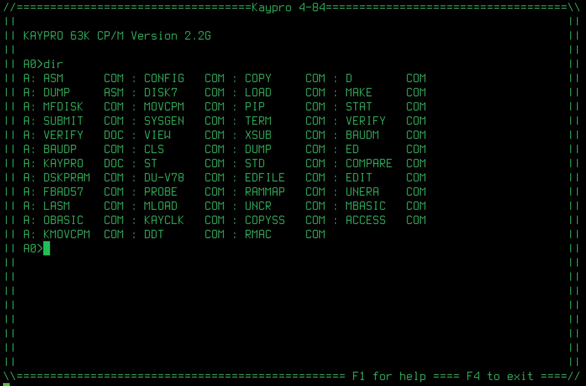
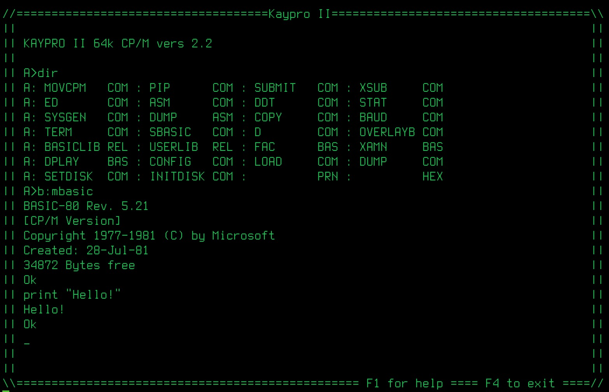
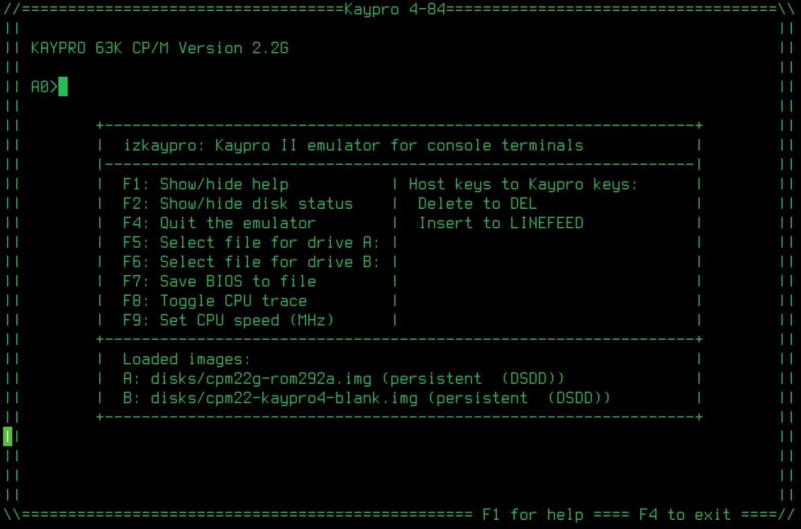

# Kaypro emulator on the terminal

[](https://github.com/eneilson-zz/izkaypro/releases)

## What is this?

This is a Kaypro emulator that runs in a terminal window on Linux and OSX (no Windows support at this time). It supports multiple Kaypro models and can boot and use SSDD or DSDD disk images.  For best display results, set your terminal window to 86 x 28.

This is a fork of Ivan Izag's Kaypro II emulator.  It extends Ivan's work and adds support for more Kaypro models and hardware components.

Uses the [iz80](https://github.com/ivanizag/iz80) library. Made with Rust.

## What is/was a Kaypro computer?

The Kaypro computer was a luggable computer first released in 1982 with further models released through the 1980s that was capable of running CP/M 2.2. It was considered "a rugged, functional and practical computer system marketed at a reasonable price." (From [Wikipedia](https://en.wikipedia.org/wiki/Kaypro))

It's a typical CP/M computer of the early 80s, built on a metal case with standard components, a 9" green monochrome CRT, a detachable keyboard and two disk drives. Main features:

- Zilog Z80 at 2.5 MHz or 4 MHz
- 64 KB of main RAM
- 2 - 8 KB of ROM
- 2 - 4 KB of video RAM
- 80*24 text mode (no graphics capabilities) with a 25th line for status displays, such as clock
- Two single or double side double density drives with 200kb/400kb capacity
- One or more serial ports (SIO-1, Channel A is emulated for serial port connections on K4-84 models)
- One parallel port (not emulated by izkaypro)

## Supported Models
This version of the emulator expands support to the Kaypro 4/83, 2X/4-84, TurboROM and KayPLUS ROM-enabled 4-84s.

| Model | ROM | Disk Format | Video Mode |
|-------|-----|-------------|------------|
| Kaypro II | 81-149c | SSDD (200KB) | Memory-mapped |
| Kaypro 4/83 | 81-232 | DSDD (400KB) | Memory-mapped |
| Kaypro 2X/4/84 | 81-292a | DSDD (400KB) | SY6545 CRTC |
| TurboROM 3.4 | trom34 | DSDD (400KB) | SY6545 CRTC |
| KayPLUS 84 | kplus84 | DSDD (400KB) | SY6545 CRTC |

## Configuration

Edit `izkaypro.toml` to select the Kaypro model by uncommenting the desired configuration:

```toml
# --- Kaypro II ---
# model = "kaypro_ii"

# --- Kaypro 4/83 ---
# model = "kaypro4_83"

# --- Kaypro 4/84 (default) ---
model = "kaypro4_84"

# --- TurboROM 3.4 ---
# model = "turbo_rom"

# --- KayPLUS 84 ---
# model = "kayplus_84"
```

Optional: override default disk images by adding:
```toml
disk_a = "disks/my_boot_disk.img"
disk_b = "disks/my_data_disk.img"
```
## How to build and run
From the main directory:  
- To build type **cargo build --release**  
- To run **../target/release/izkaypro**  

## Usage examples

izkaypro does not require installation, you just need the executable. It has the default ROM embedded as well as the boot CP/M disk and a blank disk. You can provide additional disk images as separate files.

Run using internal defaults (currently set to the Kaypro 4-84 machine)
- ./target/release/izkaypro

Run using a different machine and disk images
- ./target/release/izkaypro --model=turbo_rom --driveb=./disks/games/Games.img

Run connecting to a serial device
- ./target/release/izkapro --serial=/dev/tty.usbserial-A60288TV --driveb=./disks/comm/k4-84-qterm.img

### What the emulator looks like
By default, the emulator boots a Kaypro 4-84 machine with the CP/M 2.2g boot disk in drive A and a blank boot disk in drive B. You can type DIR to see a directory listing and B: to change drives. 



### Usage with external images
The ./disks/ directory contains a number of Kaypro disk images to try. When starting the emulator, you can provide disk images on the command with the --drivea=path.to.disk.image or --driveb=path.to.disk.image parameters.

While using the emulator, press F5 or F6 to insert a new disk into drives A or B respectively (Note: CP/M likes to have the boot disk stay in drive A).  Press F4 to exit back to the host shell prompt.

If using the Kaypro II configuration, the images have to be raw binary images of single-sided, double-density disks. The size must be 204800 bytes. See [disk images](doc/disk_images.md).

If using the Kaypro IV, 4-84, or 4-84 TurboROM/KayPLUS configurations, images can be either SSDD or DSDD disk images. Sample images of both sizes are provided in the disks directory. If you swap disks, some BIOS versions require you to warm boot (Ctrl-C) in order to re-load the new disk so that the BIOS will properly detect SSDD or DSDD format.

Note: KayPLUS-formatted disks use sector IDs 0-9 on both sides (side selected via port 0x14 bit 2), unlike standard Kaypro DSDD disks which use sector IDs 10-19 on side 1. The `kayplus_84` model preset handles this automatically.



### In-Program help
Press F1 to get additional help:



## Build from source

To build from source, install the latest Rust compiler, clone the repo and run `cargo build --release`. To build and run directly execute `cargo run`.

## Command line usage
```
izkaypro [OPTIONS]

OPTIONS:
    -m, --model <MODEL>      Kaypro model preset
                             [models: kaypro_ii, kaypro4_83, kaypro4_84,
                              turbo_rom, kayplus_84, custom]
    -a, --drivea <FILE>      Disk image file for drive A
    -b, --driveb <FILE>      Disk image file for drive B
        --rom <FILE>         Custom ROM file (implies --model=custom)
        --speed <MHZ>        CPU clock speed in MHz (1-100, default: unlimited)
        --serial <DEVICE>    Connect SIO-1 Port A to a serial device
    -d, --diagnostics        Run ROM and RAM diagnostics then exit
        --boot-test          Run headless boot tests for all models then exit
    -h, --help               Print help information
    -V, --version            Print version information

TRACE OPTIONS:
    -c, --cpu-trace          Trace CPU instruction execution
    -i, --io-trace           Trace I/O port access
    -f, --fdc-trace          Trace floppy disk controller commands
    -w, --fdc-trace-rw       Trace floppy disk controller read/write data
    -s, --system-bits        Trace system bit changes
    -r, --rom-trace          Trace ROM entry point calls
        --bdos-trace         Trace CP/M BDOS calls
    -v, --crtc-trace         Trace SY6545 CRTC VRAM writes
        --sio-trace          Trace SIO-1 Channel A serial port
        --rtc-trace          Trace MM58167A real-time clock register access
        --trace-all          Enable all trace options
```

## Resources

- [ROM disassembled and commented](https://github.com/ivanizag/kaypro-disassembly)
- [Kaypro manuals in bitsavers](http://bitsavers.informatik.uni-stuttgart.de/pdf/kaypro/)
- [Disks from retroarchive](http://www.retroarchive.org/maslin/disks/kaypro/)
- [ImageDisk and system images](http://dunfield.classiccmp.org/img/index.htm)
