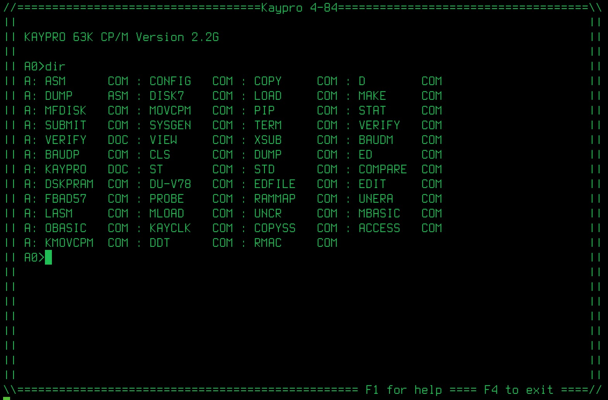
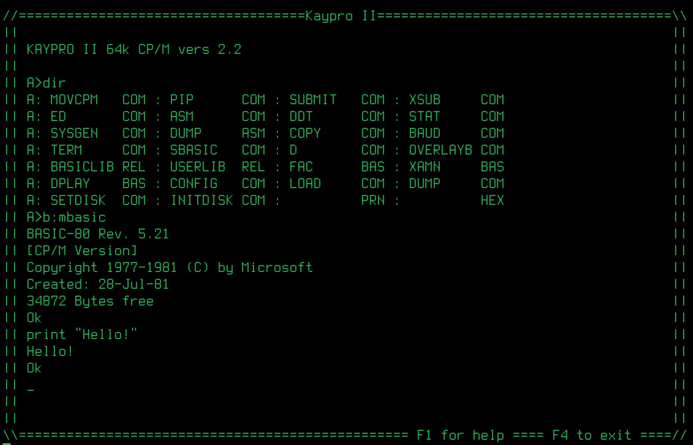
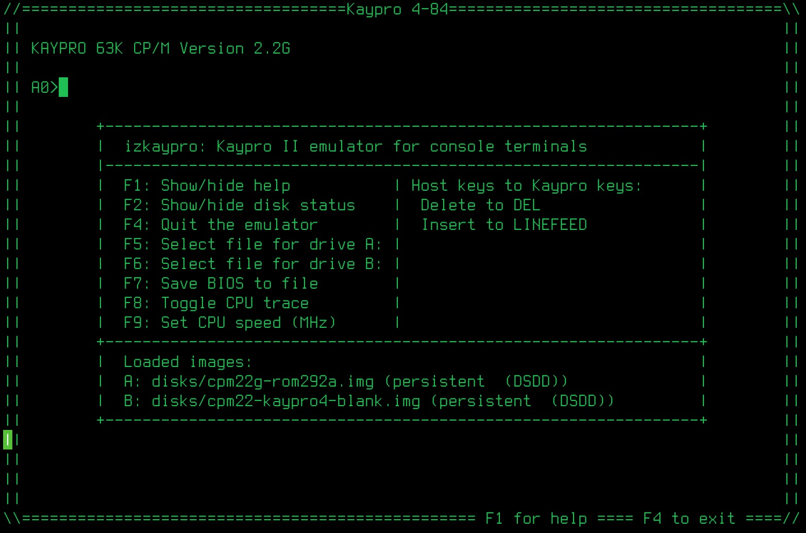
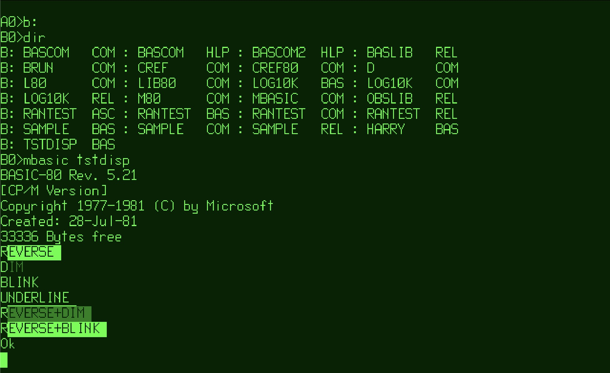
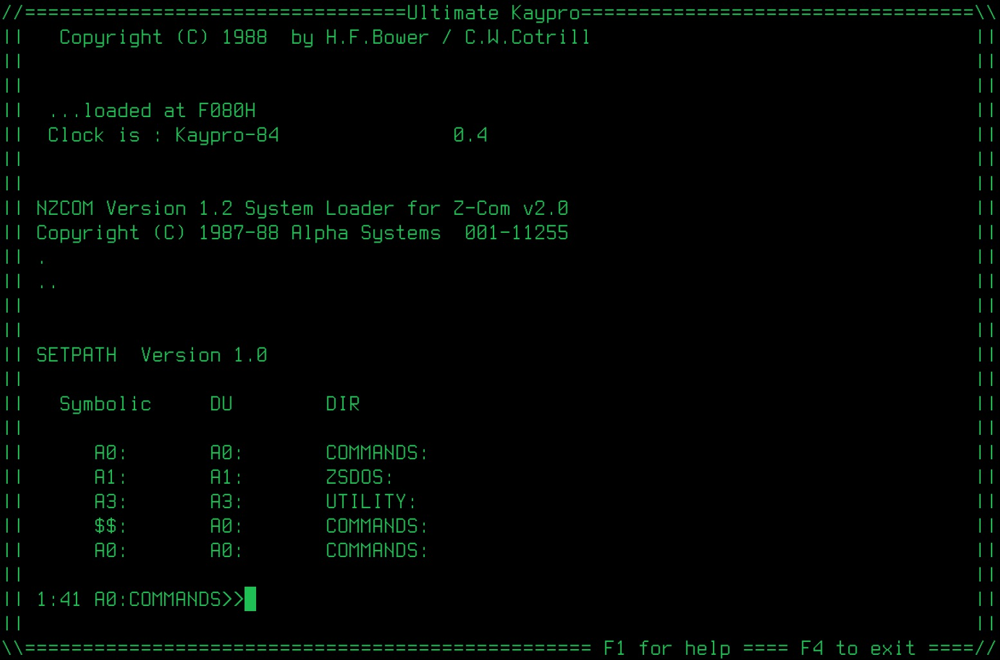
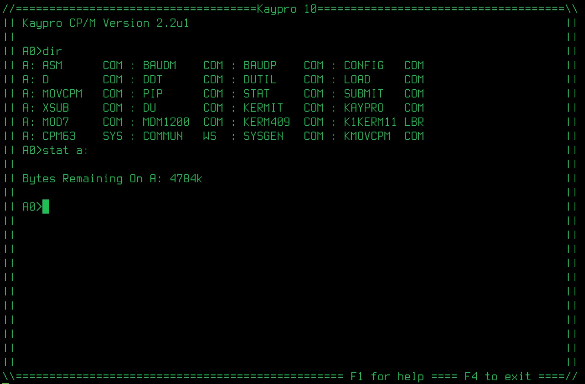

# The Ultimate Kaypro Emulator

[Latest Release](https://github.com/eneilson-zz/izkaypro/releases)

## What is this?
izkaypro is an emulator for the 1980s Kaypro family of CP/M luggables. It runs in
a terminal window on Linux, macOS, FreeBSD, and Windows, or in a native window
rendered through the original Kaypro character-generator ROMs with a simulated
phosphor display. It emulates nine Kaypro models — from the original Kaypro II to
the hard-disk Kaypro 10, the TurboROM and KayPLUS variants, and the Micro
Cornucopia PRO 884-MAX — across their different ROMs, video hardware, and disk
controllers.

This emulator is a fork of Ivan Izaguirre's Kaypro II emulator. It extends Ivan's
work with support for many more Kaypro models and hardware components.

- For the best results in terminal mode, size your terminal to 86 × 28 (or pass
  `--no-border` and use 80 × 26).
- For the most authentic experience, add `--chargen` to render a Kaypro-native
  display, including graphics. (Copy/paste is unavailable in this mode.)

## Features

**Machines & ROMs**
- Nine ready-to-run model presets plus a `custom` mode — see [Supported models](#supported-models).
- Load any Kaypro ROM with `--rom`.
- Runs on Linux, macOS, FreeBSD, and Windows.
- Self-contained: the default ROM and a bootable CP/M disk are embedded, so it
  runs with no installation and no extra files.

**Display**
- ANSI terminal rendering, or a native **`--chargen`** window that draws through
  the genuine Kaypro chargen ROMs.
- All video attributes are supported (reverse, dim, blink, underline) and hardware cursor via
  the SY6545 CRTC, plus the Kaypro block-graphics character set when in --chargen mode.
- Simulated **phosphor** display with green / amber / white / blue presets and
  per-channel hex overrides.

**Audio**
- Authentic **keyboard bell**: the Ctrl-G beep reproduced as the real keyboard's
  **1.5625 kHz square wave**, synthesized on your computer's audio output.

**Printing**
- **Centronics parallel printer** capture: anything sent to the LST: device is
  written to **`~/kaypro.out`** — see [Printer support](#printer-support).

**Storage**
- WD1793 floppy controller with two drives; SSDD (200 KB) and DSDD (400 KB)
  images, auto-detected by size.
- WD1002-05 Winchester **hard disk** on the Kaypro 10 and TurboROM+HD machines.
- **Hot disk swapping** in the GUI (F5 / F6).
- TurboROM **foreign-format** floppies (Osborne, Xerox 820, Epson QX-10) read
  straight from raw images.

**Communications & time**
- **Serial port**: connect SIO-1 Channel A to a real serial device with
  `--serial` (e.g. a USB adapter for terminal/BBS use). For example: `./target/release/izkaypro --serial /dev/tty.usbserial-A60288TV --driveb ./disks/comm/k4-84-qterm.img`
- **Real-time clock**: full **MM58167A RTC** emulation, kept in sync with your
  host clock. It drives the live on-screen clock in the 25th status line (e.g.
  the PRO 884-MAX and NZ-COM displays) and provides date/time stamping for ZSDOS
  — and it keeps working correctly even at unlimited CPU speed.

**CP/M software**
- **NZ-COM + ZSDOS** (ZCPR3) ready to run on the Ultimate Kaypro.
- A large bundled library of disk images in `./disks` — games, productivity,
  programming tools, and communications software.

**For tinkerers**
- Adjustable CPU speed (`--speed`, default unlimited; toggle in the GUI with F9).
- Headless self-test (`--boot-test`) and ROM/RAM diagnostics (`--diagnostics`).
- Fine-grained tracing for every emulated device (FDC, HDC, RTC, SIO, CRTC, CPU,
  I/O ports, BDOS, ROM entry points).
- Configure via `izkaypro.toml` or the command line; paths resolve relative to
  the executable so installed release layouts just work.

## Supported models
The emulator supports the Kaypro II, 4/83, 2X/4-84, TurboROM, TurboROM+HD,
KayPLUS ROM-enabled 4-84s, the Kaypro 10 with WD1002-05 hard disk controller, and
the Micro Cornucopia PRO 884-MAX ROM. It will probably work with other Kaypro
ROMs as well; those above are the tested presets.

| Model | `--model` | ROM | Disk Format | Video Mode |
|-------|-----------|-----|-------------|------------|
| Kaypro II | `kaypro_ii` | 81-149c | SSDD (200KB) | Memory-mapped |
| Kaypro 4/83 | `kaypro4_83` | 81-232 | DSDD (400KB) | Memory-mapped |
| Kaypro 2X/4/84 | `kaypro4_84` | 81-292a | DSDD (400KB) | SY6545 CRTC |
| TurboROM 3.4 | `turbo_rom` | trom34 | DSDD (400KB) | SY6545 CRTC |
| TurboROM 3.4 + HD | `turbo_rom_hd` | trom34 | DSDD floppies + HD | SY6545 CRTC |
| KayPLUS 84 | `kayplus_84` | kplus84 | DSDD (400KB) | SY6545 CRTC |
| Kaypro 10 | `kaypro10` | 81-478c | 10MB HD + DSDD floppy | SY6545 CRTC |
| Ultimate (NZ-COM/ZSDOS) | `ultimate` | trom34 | DSDD floppies + HD | SY6545 CRTC |
| PRO 884-MAX (Micro Cornucopia) | `pro884mx` | pro884_smx | DSDD (400KB) | SY6545 CRTC |

## How to build and run

To build from source, [install Rust 1.87 or later for your platform](https://rust-lang.org/tools/install/).

From the main directory:
- Clone the repo and run `cargo build --release`
- Run it with `./target/release/izkaypro`

### Pre-built binaries
If you don't want to compile it yourself, download a pre-built binary for Mac,
Windows, or Linux from the release page.

### Linux build dependencies
On Ubuntu/Debian, install the following packages before building. `libasound2-dev`
provides ALSA for the keyboard bell audio; the rest are for the `--chargen` GUI:

```
sudo apt install libasound2-dev libxkbcommon-dev libx11-dev libxcursor-dev libwayland-dev libgtk-3-dev
```

The pre-built Linux binary links ALSA dynamically, so the runtime library
(`libasound2`, present on essentially every desktop Linux) must be installed.

## Running the emulator

izkaypro requires no installation — just the executable. The default ROM, a boot
CP/M disk, and a blank disk are embedded, and there are many more disk images to
play with in `./disks`.

- Run the internal default (Kaypro 4-84): `./target/release/izkaypro`
- Pick a model: `./target/release/izkaypro --model kaypro10`
- Native rendering: `./target/release/izkaypro --model ultimate --chargen`
- A different machine + disk: `./target/release/izkaypro --model turbo_rom --driveb ./disks/games/Games.img`
- Attach a serial device: `./target/release/izkaypro --serial /dev/tty.usbserial-A60288TV --driveb ./disks/comm/k4-84-qterm.img`

Run `./target/release/izkaypro -h` to see all the options, or the full
[command line reference](#command-line-usage) below.

By default the emulator boots a Kaypro 4-84 with the CP/M 2.2g boot disk in drive
A and a blank disk in drive B. Type `DIR` for a directory listing and `B:` to
change drives.



### Using and swapping disk images
The `./disks/` directory contains many Kaypro disk images. Supply them on the
command line with `--drivea path.img` / `--driveb path.img`, or, while running,
press **F5** / **F6** to insert a new image into drive A / B (CP/M prefers the
boot disk to stay in drive A). Press **F4** to exit, **F1** for in-program help.

If you swap disks, some BIOS versions need a warm boot (Ctrl-C) to re-read the new
disk's SSDD/DSDD format. Kaypro II images must be raw single-sided double-density
images of exactly 204,800 bytes — see [disk images](doc/disk_images.md). The
Kaypro 4/84 and TurboROM/KayPLUS configs accept either SSDD or DSDD images.

KayPLUS-formatted disks use sector IDs 0–9 on both sides (side selected via port
0x14 bit 2), unlike standard Kaypro DSDD disks which use IDs 10–19 on side 1. The
`kayplus_84` preset handles this automatically.





## Native rendering & phosphor colors
Launch with `--chargen` to open a native window that renders any emulated machine
through the actual Kaypro chargen ROM — including all video attributes (reverse,
dim, blink, underline), the SY6545 hardware cursor, graphics, and full keyboard
input (function keys, Ctrl/Shift). Chargen support is in the default build.

Choose a phosphor color with `--phosphor`:
- `green` (default) — P1 green: fg=#33FF33, bg=#002200, dim=#1A801A
- `amber` — P3 amber: fg=#FFB833, bg=#221100, dim=#805C1A
- `white` — P4 white: fg=#E0E0E0, bg=#181818, dim=#707070
- `blue` — cool blue: fg=#66BBFF, bg=#001122, dim=#335E80

Override individual channels with `--phosphor-fg`, `--phosphor-bg`, and
`--phosphor-dim` using hex values:

```
./izkaypro --chargen --phosphor amber
./izkaypro --chargen --phosphor-fg "#FF6600" --phosphor-bg "#110500" --phosphor-dim "#803300"
./izkaypro --chargen --phosphor white --phosphor-dim "#909090"
```


## Keyboard bell
The Ctrl-G (ASCII 7) bell is reproduced faithfully. On a real Kaypro the "beep"
lives in the detachable keyboard, where an 8049 microcontroller drives a piezo
speaker with a **1.5625 kHz square wave**; the BIOS rings it by sending a command
over the keyboard serial link. izkaypro emulates that exact path and synthesizes
the tone on your computer's default audio output (CoreAudio on macOS, WASAPI on
Windows, ALSA on Linux).

## Printer support
Every Kaypro has a Centronics parallel printer port. izkaypro captures everything
the system sends to the printer (the CP/M LST: device) to a file named
**`kaypro.out`** in your home directory. The file is created on the first printed
byte and appended to thereafter, so jobs accumulate across sessions.

Any program that prints works — `PIP LST:=A:FILE.TXT`, `^P` console echo, word
processors, and so on. Captured bytes are masked to 7-bit ASCII (the standard
behavior for a CP/M text printer), so the high-bit formatting characters that
software like WordStar and NZ-COM use come out as clean, readable text.

## The Ultimate Kaypro
A Kaypro 4-84 with a TurboROM BIOS plus hard disk support. Run
`./izkaypro --model turbo_rom_hd` to boot from a TurboROM hard disk image: drives
A and B are 5 MB hard disk partitions, drives C and D are DSDD floppies, and the
RTC, printer port and serial port are present too.

**With NZ-COM and ZSDOS** you can run the ultimate CP/M system on top of the Ultimate Kaypro (the penultimate Kaypro?). The CP/M replacement NZ-COM is loaded onto the `turborom_nz.hd` image, along with the
ZSDOS BDOS replacement that adds date/time stamping using the Kaypro real-time
clock. Run `./izkaypro --model ultimate --chargen` (`--chargen` optional); once
booted, type `nzcom` and you'll see the time next to the prompt. Type `zxd` for a
directory listing with date/time columns.

The TurboROM-enabled Kaypro was special because it let you attach a hard drive yet
still keep a 62.5 KB TPA (about 8 KB more than the stock Kaypro 10 HD BIOS). The
`turborom_nz.hd` image is filled with useful applications and utilities across its
user areas.

**Welcome to peak 80's CP/M computing!**



## Kaypro 10
The Kaypro 10 is a great machine to start with: a DSDD floppy (drive C) plus a
10 MB hard disk partitioned into two 5 MB drives (A and B).

- `./target/release/izkaypro --model kaypro10`
- Native rendering: `./target/release/izkaypro --model kaypro10 --chargen`



## Micro Cornucopia PRO 884-MAX ROM
The PRO 884-MAX (also called "Max") was a third-party ROM replacement for the
Kaypro 4-84 from Micro Cornucopia in the mid-1980s. It added a configurable status
line with real-time clock display, enhanced BIOS features, and custom key
remapping, and shipped with its own configuration utility (MCONFIG) and a disk of
utilities.

- `./target/release/izkaypro --model pro884mx`
- `./target/release/izkaypro --model pro884mx --chargen`

Run MCONFIG from the boot disk to enable the status line, clock display, and other
ROM features. The clock is driven by the Kaypro MM58167A RTC and shows live time
in the status bar.

## TurboROM non-Kaypro floppy formats
The TurboROM variants (`turbo_rom`, `turbo_rom_hd`, and `ultimate`) can read
several non-Kaypro floppy formats directly from raw `.img` files, mirroring
TurboROM's native foreign-format capability.

| Format | Geometry | Raw image size | Notes |
|--------|----------|----------------|-------|
| Osborne SSSD | 40T x 1S x 10 x 256B | 102,400 bytes | Single-density (FM), sector IDs 1-10 |
| Osborne SSDD (Advent 1K) | 40T x 1S x 5 x 1024B | 204,800 bytes | Double-density (MFM), sector IDs 1-5 |
| Xerox 820-1 SSSD | 40T x 1S x 18 x 128B | 92,160 bytes | Single-density (FM), sector IDs 1-18 |
| Epson QX-10 DSDD | 40T x 2S x 16 x 256B | 327,680 bytes | Double-density (MFM), sector IDs 1-16 on both sides |

These are raw sector images. If you start from flux/container formats like HFE or
IMD, convert them to raw IMG first.

## Configuration
Edit `izkaypro.toml` to choose the default model by uncommenting one configuration:

```toml
# --- Kaypro II ---
# model = "kaypro_ii"

# --- Kaypro 4/83 ---
# model = "kaypro4_83"

# --- Kaypro 4/84 (default) ---
model = "kaypro4_84"

# --- TurboROM 3.4 ---
# model = "turbo_rom"

# --- TurboROM 3.4 + WD Hard Disk ---
# model = "turbo_rom_hd"

# --- KayPLUS 84 ---
# model = "kayplus_84"

# --- Kaypro 10 ---
# model = "kaypro10"

# --- Ultimate Kaypro ---
# model = "ultimate"
```

Optionally override the default disk images:
```toml
disk_a = "disks/my_boot_disk.img"
disk_b = "disks/my_data_disk.img"
```

## Command line usage
```
izkaypro [OPTIONS]

OPTIONS:
    -m, --model <MODEL>      Kaypro model preset
                             [models: kaypro_ii, kaypro4_83, kaypro4_84,
                              turbo_rom, turbo_rom_hd, ultimate, kayplus_84,
                              kaypro10, pro884mx, custom]
    -a, --drivea <FILE>      Disk image file for drive A
    -b, --driveb <FILE>      Disk image file for drive B
        --hd <FILE>          Hard disk image file for WD1002 models
        --rom <FILE>         Custom ROM file (implies --model=custom)
        --speed <MHZ>        CPU clock speed in MHz (1-100, default: unlimited)
        --serial <DEVICE>    Connect SIO-1 Port A to a serial device
        --chargen            Launch chargen rendering window
        --phosphor <COLOR>   Phosphor color: green (default), amber, white, blue
        --phosphor-fg <HEX>  Override foreground color (e.g. "#33FF33")
        --phosphor-bg <HEX>  Override background color (e.g. "#002200")
        --phosphor-dim <HEX> Override dim/half-intensity color (e.g. "#1A801A")
        --no-border          Run without screen border (fits in 80x26 terminal)
    -d, --diagnostics        Run ROM and RAM diagnostics then exit
        --boot-test          Run headless boot tests for all models then exit
    -h, --help               Print help information
    -V, --version            Print version information

TRACE OPTIONS:
    -c, --cpu-trace          Trace CPU instruction execution
    -i, --io-trace           Trace I/O port access
    -f, --fdc-trace          Trace floppy disk controller commands
    -w, --fdc-trace-rw       Trace floppy disk controller read/write data
    -s, --system-bits        Trace system bit changes
    -r, --rom-trace          Trace ROM entry point calls
        --bdos-trace         Trace CP/M BDOS calls
    -v, --crtc-trace         Trace SY6545 CRTC VRAM writes
        --sio-trace          Trace SIO-1 Channel A serial port
        --rtc-trace          Trace MM58167A real-time clock register access
        --hdc-trace          Trace WD1002-05 hard disk controller
        --trace-all          Enable all trace options
```

## What is/was a Kaypro computer?
The Kaypro was a luggable computer first released in 1982, with further models
through the 1980s, that ran CP/M 2.2. It was considered "a rugged, functional and
practical computer system marketed at a reasonable price" (from
[Wikipedia](https://en.wikipedia.org/wiki/Kaypro)).

A typical CP/M computer of the early 80s, built in a metal case with standard
components, a 9" green monochrome CRT, a detachable keyboard, and two disk drives:

- Zilog Z80 at 2.5 MHz or 4 MHz
- 64 KB of main RAM
- 2–8 KB of ROM
- 2–4 KB of video RAM
- 80×24 text mode (with a 25th status line for clocks and the like)
- Two single- or double-sided double-density drives (200 KB / 400 KB), or a hard
  disk plus a floppy on the Kaypro 10
- One or more serial ports (SIO-1; Channel A is emulated for serial connections on
  the K4-84 models)
- An MM58167A real-time clock on the 4-84-era boards (emulated)
- One Centronics parallel port (emulated — izkaypro captures printer output to
  `~/kaypro.out`)

## Resources
- [Uses the iz80 library](https://github.com/ivanizag/iz80). Made with Rust.
- [ROM disassembled and commented](https://github.com/ivanizag/kaypro-disassembly)
- [Kaypro manuals in bitsavers](http://bitsavers.informatik.uni-stuttgart.de/pdf/kaypro/)
- [Disks from retroarchive](http://www.retroarchive.org/maslin/disks/kaypro/)
- [ImageDisk and system images](http://dunfield.classiccmp.org/img/index.htm)
